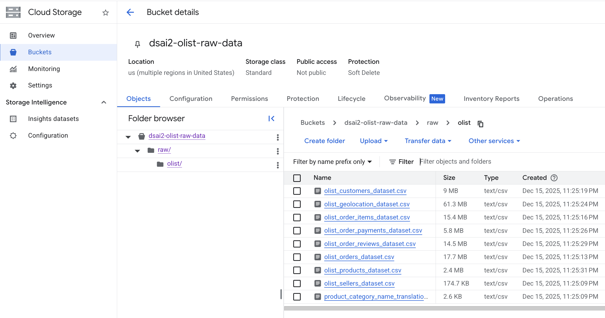
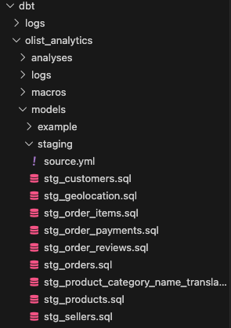
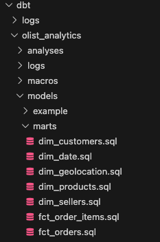
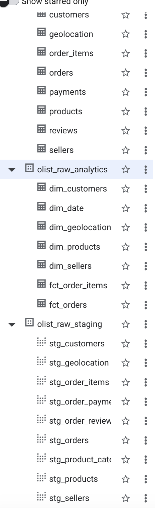

## Conda Environments

 - Install conda environments required for project &  Run the following command:

`conda env create --file prj-environment.yml`

`conda activate prj`

# Extract
Prerequisites
1. Kaggle API Key: Go to Kaggle Settings -> Create New Token. Save kaggle.json.

2. GCP Service Account: Go to GCP Console -> IAM -> Service Accounts -> Create Key (JSON). Save as gcp_key json.

3. GCS Bucket: Create a bucket (e.g., my-olist-raw-data) in Google Cloud Storage.

### Creat a bucket in google cloud storage
- bucketname:  dsai2-olist-raw-data

  Grant acces  storage storage object admin using IAM

### Saving kaggle key

 `mkdir -p ~/.kaggle`

 `cp kaggle/kaggle.json ~/.kaggle/kaggle.json`

### Execute Extract & load.
- Update the configuration according to your credentials in ingest_olist.py
```Config
   # --- CONFIGURATION ---
   KAGGLE_DATASET = "olistbr/brazilian-ecommerce"
   LOCAL_DOWNLOAD_PATH = "./temp_data"
   GCS_BUCKET_NAME = "dsai2-olist-raw-data"    # Your GCS Bucket Name
   GCS_DESTINATION_FOLDER = "raw/olist/"      # Folder inside the bucket
   GCP_KEY_PATH = "stellar-verve-478012-n6-5c79fd657d1a.json"              # Path to your Service Account Key
```


- Run below command in terminal.

  `python ingest_olist.py`
- Check the Google Storage whether the files are uploaded. 




# Load
### Load data from GCS to BigQuery using Meltano dbt
- Run below commands in terminal.

  `meltano init`
( Enter the project name as Melt). It will create a folder \Melt

  `cd Melt`

  `meltano invoke dbt-bigquery:initialize`

- It creates transform/dbt_project.yml.

- It creates transform/profiles/bigquery/profiles.yml.

- It sets up the basic folder structure (models, seeds, etc.).

- Right-click transform/ -> New File -> Name it packages.yml. (If package.yml is not available in \Melt\transform)

Paste this content into transform/packages.yml:
```packages
packages:
  - package: dbt-labs/dbt_external_tables
    version: 0.12.0
```
Paste below content into transform/dbt_project.yml:
```
name: my_meltano_project
version: '1.0'
profile: meltano
config-version: 2
require-dbt-version: [">=1.0.0", "<2.0.0"]
flags:
  send_anonymous_usage_stats: False
  use_colors: True
  partial_parse: true
model-paths:
- models
analysis-paths:
- analysis
test-paths:
- tests
seed-paths:
- data
macro-paths:
- macros
snapshot-paths:
- snapshots
target-path: target
log-path: logs
packages-install-path: dbt_packages
clean-targets:
- target
- dbt_packages
- logs
models:
  my_meltano_project: null

```

Create transform/profiles/bigquery/profiles.yml( if not exists)

Paste below content into transform/profiles/bigquery/profiles.yml:
- Replace 'project: stellar-verve-478012-n6' With your bigquery project id
- Replace "keyfile: /Users/govindandhanasekaran/Dev/Github/M2_PROJECT/stellar-verve-478012-n6-5c79fd657d1a.json"  With path of your google cloud key jason file
```
# transform/profiles/bigquery/profiles.yml
meltano:
  target: dev
  outputs:
    dev:
      type: bigquery
      method: service-account
      # These env_vars are standard for Meltano dbt-bigquery
      project: stellar-verve-478012-n6
      dataset: dbt_dev
      keyfile: /Users/govindandhanasekaran/Dev/Github/M2_PROJECT/stellar-verve-478012-n6-5c79fd657d1a.json
      threads: 1
      timeout_seconds: 300
      location: US
      priority: interactive
```
#### Verification
Once you have done either Solution 1 or 2, verify the fix by running:

`meltano invoke dbt-bigquery:debug`

If you see "All checks passed!", you are ready to proceed next step

#### Install the dependencies: Run this command in your terminal to download that package

  `meltano invoke dbt-bigquery:deps`

Success Indicator: You should see a message saying: Installing dbt-labs/dbt_external_tables Installed from version 0.12.0

Update only below block in /Melt/meltano.yml

Replace keyfile: stellar-verve-478012-n6-5c79fd657d1a.json with Google cloud keyfile 

Repalce project: stellar-verve-478012-n6  with  your bigquery project

```
....
plugins:
  utilities:
  - name: dbt-bigquery
    variant: dbt-labs
    pip_url: dbt-core dbt-bigquery meltano-dbt-ext~=0.3.0
    config:
      keyfile: stellar-verve-478012-n6-5c79fd657d1a.json  ##<- Repalce your google cloud json
      project: stellar-verve-478012-n6  ## <- Replace your bigquery project
      dataset: dbt_dev
    commands:
      run-operation:
      args: run-operation
      description: Run a specific dbt operation macro  
```
#### Define your Sources 
create Melt/transform/models/staging/src_olist.yml (if not exist)
(make sure to replace the projectid)


```
version: 2

sources:
  - name: olist_raw
    database: stellar-verve-478012-n6 # <--- Replace with your GCP Project ID
    schema: olist_raw          # The dataset in BigQuery
    loader: gcs_external
    
    tables:
      # 1. Orders
      - name: orders
        description: "Raw orders data from GCS"
        external:
          location: "gs://dsai2-olist-raw-data/raw/olist/olist_orders_dataset.csv"
          options:
            format: csv
            skip_leading_rows: 1
            allow_jagged_rows: true
            quote: '"'

      # 2. Customers (Repeat for other files in your screenshot)
      - name: customers
        external:
          location: "gs://dsai2-olist-raw-data/raw/olist/olist_customers_dataset.csv"
          options:
            format: csv
            skip_leading_rows: 1
      
      # 3. Geolocation (Repeat for other files in your screenshot)
      - name: geolocation
        external:
          location: "gs://dsai2-olist-raw-data/raw/olist/olist_geolocation_dataset.csv"
          options:
            format: csv
            skip_leading_rows: 1

      # 4. Order_items (Repeat for other files in your screenshot)
      - name: order_items
        external:
          location: "gs://dsai2-olist-raw-data/raw/olist/olist_order_items_dataset.csv"
          options:
            format: csv
            skip_leading_rows: 1

      # 5. Payments (Repeat for other files in your screenshot)
      - name: payments
        external:
          location: "gs://dsai2-olist-raw-data/raw/olist/olist_order_payments_dataset.csv"
          options:
            format: csv
            skip_leading_rows: 1

      # 6. Reviews (Repeat for other files in your screenshot)
      - name: reviews
        external:
          location: "gs://dsai2-olist-raw-data/raw/olist/olist_order_reviews_dataset.csv"
          options:
            format: csv
            skip_leading_rows: 1

      # 7. Products (Repeat for other files in your screenshot)
      - name: products
        external:
          location: "gs://dsai2-olist-raw-data/raw/olist/olist_products_dataset.csv"
          options:
            format: csv
            skip_leading_rows: 1

      # 8. Sellers (Repeat for other files in your screenshot)
      - name: sellers
        external:
          location: "gs://dsai2-olist-raw-data/raw/olist/olist_sellers_dataset.csv"
          options:
            format: csv
            skip_leading_rows: 1

      # 9. Product Category Name Translation (Repeat for other files in your screenshot)
      - name: category_translation
        external:
          location: "gs://dsai2-olist-raw-data/raw/olist/product_category_name_translation.csv"
          options:
            format: csv
            skip_leading_rows: 1
```

#### Run the load
Fynally Run this command.  this will load the data to bigQuery

`meltano invoke dbt-bigquery:run-operation stage_external_sources --args "{select: olist_raw}"`


# DBT Setup
### Step 1: Initialize the Project
  Navigate to your preferred directory and create a new project.
    Enter the following commend in the terminal. ( ensure the you are in parent drectory)

  `md dbt`

  `cd dbt`

  `dbt init olist_analytics`
  
      - Database: Choose bigquery.

      - Auth: Choose oauth (recommended for local dev) or service_account.

      - Project ID: Enter your GCP Project ID.

      - Dataset: Enter the name of the target dataset where dbt will build your models (e.g., analytics or dbt_prod).

Response
----------
`
14:02:47  Setting up your profile.

Which database would you like to use?
[1] bigquery

(Don't see the one you want? https://docs.getdbt.com/docs/available-adapters)

Enter a number: 1

/Users/govindandhanasekaran/miniconda3/envs/prj/lib/python3.11/site-packages/google/cloud/aiplatform/models.py:52: FutureWarning: Support for google-cloud-storage < 3.0.0 will be removed in a future version of google-cloud-aiplatform. Please upgrade to google-cloud-storage >= 3.0.0.

  from google.cloud.aiplatform.utils import gcs_utils

[1] oauth

[2] service_account

Desired authentication method option (enter a number): 1

project (GCP project id): stellar-verve-478012-n6

dataset (the name of your dbt dataset): olist_raw

threads (1 or more): 1

job_execution_timeout_seconds [300]: 

[1] US

[2] EU

Desired location option (enter a number): 1

14:06:18  Profile olist_analytics written to /Users/govindandhanasekaran/.dbt/profiles.yml using target's profile_template.yml and 
your supplied values. Run 'dbt debug' to validate the connection.

-----------

### Step 2: Define Your Sources (Staging Layer)
We need to tell dbt where your raw Meltano data lives.

1. Create a file models/staging/sources.yml.

2. Define your raw tables (adjust database and schema to match your BigQuery setup).

Copy-paste the below content in to source.yml

```
version: 2

sources:
  - name: olist_raw
    database: stellar-verve-478012-n6
    schema: olist_raw # Where Meltano loaded the data
    tables:
      - name: orders
      - name: order_items
      - name: products
      - name: customers
      - name: sellers
      - name: geolocation
      - name: payments
      - name: reviews
      - name: category_translation
```
### Step 3: Create Staging Models
Copy-paste the Sql below files in  .model\staging\ folder 



Once you have created these 9 files, run the following command in your terminal to verify they all work:

`dbt run --select staging`

The results should be as below 

----
15:14:48  1 of 9 START sql view model olist_raw.stg_customers ............................ [RUN]

15:14:49  1 of 9 OK created sql view model olist_raw.stg_customers ....................... [CREATE VIEW (0 processed) in 1.49s]

15:14:49  2 of 9 START sql view model olist_raw.stg_geolocation .......................... [RUN]

15:14:51  2 of 9 OK created sql view model olist_raw.stg_geolocation ..................... [CREATE VIEW (0 processed) in 1.47s]

15:14:51  3 of 9 START sql view model olist_raw.stg_order_items .......................... [RUN]

15:14:52  3 of 9 OK created sql view model olist_raw.stg_order_items ..................... [CREATE VIEW (0 processed) in 1.43s]

15:14:52  4 of 9 START sql view model olist_raw.stg_order_payments ....................... [RUN]

15:14:54  4 of 9 OK created sql view model olist_raw.stg_order_payments .................. [CREATE VIEW (0 processed) in 1.43s]

15:14:54  5 of 9 START sql view model olist_raw.stg_order_reviews ........................ [RUN]

15:14:55  5 of 9 OK created sql view model olist_raw.stg_order_reviews ................... [CREATE VIEW (0 processed) in 1.43s]

15:14:55  6 of 9 START sql view model olist_raw.stg_orders ............................... [RUN]

15:14:57  6 of 9 OK created sql view model olist_raw.stg_orders .......................... [CREATE VIEW (0 processed) in 1.26s]

15:14:57  7 of 9 START sql view model olist_raw.stg_product_category_name_translation .... [RUN]

15:14:58  7 of 9 OK created sql view model olist_raw.stg_product_category_name_translation  [CREATE VIEW (0 processed) in 1.60s]

15:14:58  8 of 9 START sql view model olist_raw.stg_products ............................. [RUN]

15:15:00  8 of 9 OK created sql view model olist_raw.stg_products ........................ [CREATE VIEW (0 processed) in 1.45s]

15:15:00  9 of 9 START sql view model olist_raw.stg_sellers .............................. [RUN]

15:15:01  9 of 9 OK created sql view model olist_raw.stg_sellers ......................... [CREATE VIEW (0 processed) in 1.42s]

15:15:01  
15:15:01  Finished running 9 view models in 0 hours 0 minutes and 13.92 seconds (13.92s).
15:15:01  
15:15:01  Completed successfully
15:15:01  
15:15:01  Done. PASS=9 WARN=0 ERROR=0 SKIP=0 TOTAL=9

-----

### Step 4: Create Dimension and fact Models (Marts Layer)
Copy-paste the Sql below files in  .model\marts\ folder 



### Step 5: Update dbt_project
- Open dbt_project.yml
- Find the models: section at the bottom of the file.

```

# Name your project! Project names should contain only lowercase characters
# and underscores. A good package name should reflect your organization's
# name or the intended use of these models
name: 'olist_analytics'
version: '1.0.0'

# This setting configures which "profile" dbt uses for this project.
profile: 'olist_analytics'

# These configurations specify where dbt should look for different types of files.
# The `model-paths` config, for example, states that models in this project can be
# found in the "models/" directory. You probably won't need to change these!
model-paths: ["models"]
analysis-paths: ["analyses"]
test-paths: ["tests"]
seed-paths: ["seeds"]
macro-paths: ["macros"]
snapshot-paths: ["snapshots"]

clean-targets:         # directories to be removed by `dbt clean`
  - "target"
  - "dbt_packages"


# Configuring models
# Full documentation: https://docs.getdbt.com/docs/configuring-models

# In this example config, we tell dbt to build all models in the example/
# directory as views. These settings can be overridden in the individual model
# files using the `{{ config(...) }}` macro.
models:
  olist_analytics:
    # Config indicated by + and applies to all files under models/example/
    #example:
    #  +materialized: view
    staging:
      # Staging models are lightweight cleaning steps.
      # We keep them as 'views' so they always reflect fresh raw data 
      # and don't take up extra storage.
      +materialized: view
      +schema: staging
    marts:
      # Marts (Facts & Dims) are queried frequently by BI tools.
      # We materialize them as 'tables' to improve query performance
      # and reduce BigQuery compute costs for end-users.
      +materialized: table
      +schema: analytics
```
### Step 6: Rundbt
`dbt run`

-----
16:13:20  1 of 16 START sql table model olist_raw_analytics.dim_date ..................... [RUN]
16:13:23  1 of 16 OK created sql table model olist_raw_analytics.dim_date ................ [CREATE TABLE (1.5k rows, 0 processed) in 2.81s]
16:13:23  2 of 16 START sql view model olist_raw_staging.stg_customers ................... [RUN]
16:13:24  2 of 16 OK created sql view model olist_raw_staging.stg_customers .............. [CREATE VIEW (0 processed) in 1.31s]
16:13:24  3 of 16 START sql view model olist_raw_staging.stg_geolocation ................. [RUN]
16:13:26  3 of 16 OK created sql view model olist_raw_staging.stg_geolocation ............ [CREATE VIEW (0 processed) in 1.39s]
16:13:26  4 of 16 START sql view model olist_raw_staging.stg_order_items ................. [RUN]
16:13:27  4 of 16 OK created sql view model olist_raw_staging.stg_order_items ............ [CREATE VIEW (0 processed) in 1.44s]
16:13:27  5 of 16 START sql view model olist_raw_staging.stg_order_payments .............. [RUN]
16:13:29  5 of 16 OK created sql view model olist_raw_staging.stg_order_payments ......... [CREATE VIEW (0 processed) in 1.62s]
16:13:29  6 of 16 START sql view model olist_raw_staging.stg_order_reviews ............... [RUN]
16:13:30  6 of 16 OK created sql view model olist_raw_staging.stg_order_reviews .......... [CREATE VIEW (0 processed) in 1.43s]
16:13:30  7 of 16 START sql view model olist_raw_staging.stg_orders ...................... [RUN]
16:13:32  7 of 16 OK created sql view model olist_raw_staging.stg_orders ................. [CREATE VIEW (0 processed) in 1.69s]
16:13:32  8 of 16 START sql view model olist_raw_staging.stg_product_category_name_translation  [RUN]
16:13:33  8 of 16 OK created sql view model olist_raw_staging.stg_product_category_name_translation  [CREATE VIEW (0 processed) in 1.18s]
16:13:33  9 of 16 START sql view model olist_raw_staging.stg_products .................... [RUN]
16:13:34  9 of 16 OK created sql view model olist_raw_staging.stg_products ............... [CREATE VIEW (0 processed) in 1.52s]
16:13:34  10 of 16 START sql view model olist_raw_staging.stg_sellers .................... [RUN]
16:13:36  10 of 16 OK created sql view model olist_raw_staging.stg_sellers ............... [CREATE VIEW (0 processed) in 1.23s]
16:13:36  11 of 16 START sql table model olist_raw_analytics.dim_customers ............... [RUN]
16:13:40  11 of 16 OK created sql table model olist_raw_analytics.dim_customers .......... [CREATE TABLE (96.1k rows, 8.6 MiB processed) in 4.40s]
16:13:40  12 of 16 START sql table model olist_raw_analytics.dim_geolocation ............. [RUN]
16:13:48  12 of 16 OK created sql table model olist_raw_analytics.dim_geolocation ........ [CREATE TABLE (19.0k rows, 58.4 MiB processed) in 7.78s]
16:13:48  13 of 16 START sql table model olist_raw_analytics.fct_order_items ............. [RUN]
16:13:55  13 of 16 OK created sql table model olist_raw_analytics.fct_order_items ........ [CREATE TABLE (112.7k rows, 31.6 MiB processed) in 6.90s]
16:13:55  14 of 16 START sql table model olist_raw_analytics.fct_orders .................. [RUN]
16:14:00  14 of 16 OK created sql table model olist_raw_analytics.fct_orders ............. [CREATE TABLE (99.4k rows, 16.8 MiB processed) in 4.77s]
16:14:00  15 of 16 START sql table model olist_raw_analytics.dim_products ................ [RUN]
16:14:05  15 of 16 OK created sql table model olist_raw_analytics.dim_products ........... [CREATE TABLE (33.0k rows, 2.3 MiB processed) in 4.91s]
16:14:05  16 of 16 START sql table model olist_raw_analytics.dim_sellers ................. [RUN]
16:14:08  16 of 16 OK created sql table model olist_raw_analytics.dim_sellers ............ [CREATE TABLE (3.1k rows, 170.5 KiB processed) in 3.27s]
16:14:08  
16:14:08  Finished running 7 table models, 9 view models in 0 hours 0 minutes and 51.38 seconds (51.38s).
16:14:08  
16:14:08  Completed successfully
16:14:08  
16:14:08  Done. PASS=16 WARN=0 ERROR=0 SKIP=0 TOTAL=16
------
creates dim and fact table in bigQuery



## Data Analytics and visualization
